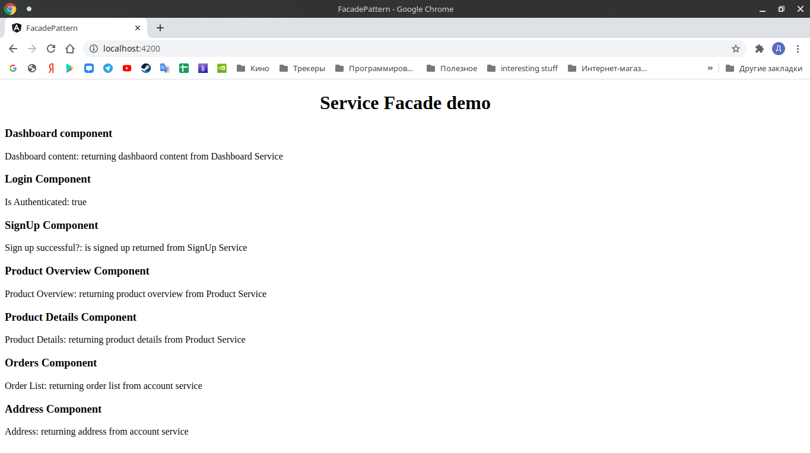

# Facade Pattern

Angular implementation of patter Facade

---
### How to start

````
1. Clone this repository
2. $ yarn or npm install
````

## Development server

Run `ng serve` for a dev server. Navigate to `http://localhost:4200/`. The app will automatically reload if you change any of the source files.

## Build

Run `ng build` to build the project. The build artifacts will be stored in the `dist/` directory. Use the `--prod` flag for a production build.

### Expected Result:


